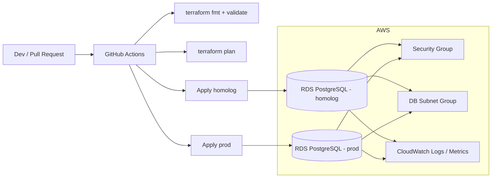

# autoservice-infra-db

Infraestrutura como codigo do banco de dados gerenciado do Tech Challenge POS TECH. Este repositorio provisiona a base PostgreSQL em AWS, com foco em seguranca, rastreabilidade, operacao corporativa e integracao com pipelines de CI/CD.

## Escopo do repositorio

- Provisionamento do banco de dados gerenciado com Terraform
- Segregacao por ambientes de homologacao e producao
- Pipeline de validacao e deploy automatizado com GitHub Actions
- Padrao de observabilidade para logs, metricas e alarmes do banco
- Documentacao tecnica das decisoes arquiteturais e da modelagem relacional

## Tecnologias

| Item | Escolha |
| --- | --- |
| Cloud | AWS |
| Banco gerenciado | Amazon RDS for PostgreSQL |
| Provisionamento | Terraform |
| CI/CD | GitHub Actions |
| Observabilidade | CloudWatch + integracao prevista com Datadog/New Relic |

## Arquitetura deste repositorio



## Estrutura

```text
.
|-- .github/workflows/terraform.yml
|-- docs/
|   |-- adr/
|   |-- model/
|   `-- rfc/
`-- terraform/
    |-- environments/
    |   |-- homolog/
    |   `-- prod/
    `-- modules/managed_postgres/
```

## Pre-requisitos

- Terraform 1.6+
- Conta AWS com permissao para criar RDS, Security Group e Subnet Group
- Secrets configurados no GitHub Actions
- VPC e subnets privadas previamente provisionadas

## Como usar localmente

1. Copie o arquivo do ambiente desejado:
   ```bash
   copy terraform\environments\homolog\terraform.tfvars.example terraform\environments\homolog\terraform.tfvars
   ```
2. Ajuste os valores de rede, credenciais e tamanho da instancia.
3. Exporte a senha do banco como variavel de ambiente:
   ```bash
   set TF_VAR_db_password=troque-esta-senha
   ```
4. Execute o fluxo Terraform:
   ```bash
   cd terraform
   terraform init
   terraform fmt -recursive
   terraform validate
   terraform plan -var-file=environments/homolog/terraform.tfvars
   terraform apply -var-file=environments/homolog/terraform.tfvars
   ```

## CI/CD

O workflow `.github/workflows/terraform.yml` executa:

- `pull_request`: `terraform fmt -check`, `terraform init -backend=false` e `terraform validate`
- `push` em `homolog`: deploy automatico em homologacao
- `push` em `main` ou `master`: deploy automatico em producao

### Secrets esperados

| Secret | Uso |
| --- | --- |
| `AWS_ROLE_TO_ASSUME` | Role com permissao para o deploy via OIDC |
| `TF_VAR_db_password_homolog` | Senha do banco de homologacao |
| `TF_VAR_db_password_prod` | Senha do banco de producao |

## Protecao de branch

Configurar no GitHub:

- `main` ou `master` protegida, sem push direto
- merge apenas via Pull Request
- aprovacao obrigatoria antes do merge
- status checks obrigatorios do workflow Terraform

## Documentacao adicional

- [RFC 0001 - Plataforma de banco e rede](docs/rfc/0001-database-platform-and-networking.md)
- [ADR 0001 - Uso de AWS RDS PostgreSQL](docs/adr/0001-use-aws-rds-postgresql.md)
- [Justificativa e modelo relacional](docs/model/database-rationale.md)

## Swagger/Postman

Este repositorio nao expoe APIs. A documentacao de contrato das APIs protegidas deve apontar para o repositorio da aplicacao principal.

