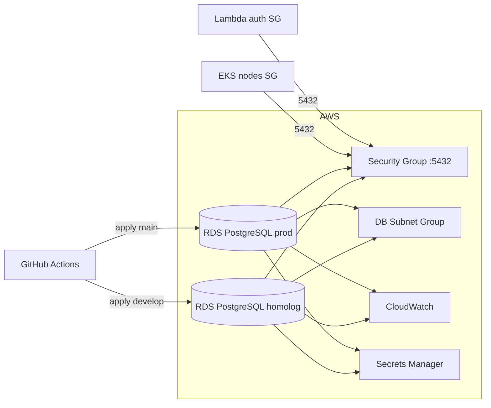
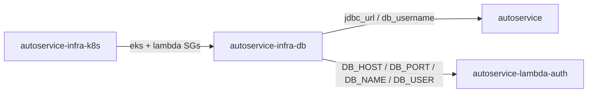

# autoservice-infra-db

Infraestrutura como código do **banco de dados gerenciado** do Tech Challenge POS TECH (SOAT).

Nas Fases 1–2 o PostgreSQL rodava localmente (Docker / K8s). Na **Fase 3** este repositório provisiona o **Amazon RDS for PostgreSQL** (homolog e prod), com segurança de rede, Secrets Manager, CloudWatch e integração com EKS + Lambda.

---

## Propósito

- Provisionar **RDS PostgreSQL** por ambiente (`homolog` / `prod`) via Terraform.
- Expor outputs (`jdbc_url`, `lambda_environment`, `security_group_id`) para a app e a Lambda.
- Documentar decisões (ADR/RFC) e a modelagem relacional do domínio da oficina.
- Automatizar validação e deploy com GitHub Actions.

### Ecossistema

| Repositório | Papel |
|-------------|--------|
| **autoservice-infra-db** (este) | Terraform RDS |
| [autoservice](https://github.com/cristhian-ruescas/autoservice) | App Spring (JDBC / JPA — schemas `cadastro`, `servico`, …) |
| [autoservice-lambda-auth](https://github.com/Zainequeiros/autoservice-lambda-auth) | Consulta CPF no schema `cadastro` |
| [autoservice-infra-k8s](https://github.com/Zainequeiros/autoservice-infra-k8s) | SGs/subnets liberados no RDS |

Diagramas ER / arquitetura: [Miro — Autoservice](https://miro.com/app/board/uXjVHprBYf0=/).

---

## Tecnologias

| Item | Escolha |
|------|---------|
| Cloud | AWS |
| Banco gerenciado | Amazon RDS for PostgreSQL |
| Provisionamento | Terraform |
| Segredos | AWS Secrets Manager |
| Observabilidade (camada DB) | CloudWatch Logs / Metrics (app/cluster → **Datadog**) |
| CI/CD | GitHub Actions (`.github/workflows/terraform.yml`) |

**Dockerfile:** não se aplica (Terraform + documentação).  
**Swagger/Postman:** não se aplica neste repo — ver links abaixo.

---

## Link Swagger / Postman

Este repositório **não** expõe APIs. Contratos das APIs protegidas:

| Recurso | Onde |
|---------|------|
| Swagger | [autoservice](https://github.com/cristhian-ruescas/autoservice) — `/swagger-ui.html` |
| Postman | [Autoservice API.postman_collection.json](https://github.com/cristhian-ruescas/autoservice/blob/develop/Autoservice%20API.postman_collection.json) |
| Endpoint RDS | output Terraform `jdbc_url` (não versionar senha) |

---

## Diagrama da arquitetura (este repositório)



Contrato com os outros repositórios:



Integração detalhada: [`docs/rds-security-groups.md`](docs/rds-security-groups.md).

---

## Modelo relacional

### Modelo usado pela aplicação (fonte da verdade)

A API Spring e a Lambda operam nos schemas **`cadastro`** e **`servico`** (entre outros), com o domínio:

**Pessoa** (física/jurídica) → **Cliente** → **Veículo** / **TipoVeiculo** → **Ordem de Serviço** → **Item de Serviço**.

Diagrama ER atual (Miro): [4. Diagrama ER — Modelo Atual](https://miro.com/app/board/uXjVHprBYf0=/).

```text
PESSOA ──┬── PESSOA_FISICA (cpf)
         └── PESSOA_JURIDICA (cnpj)
PESSOA ──── CLIENTE
PESSOA ──── VEICULO ──── TIPO_VEICULO
VEICULO ─── ORDEM_SERVICO ─── ITEM_SERVICO
```

Justificativa formal e ADRs:

- [`docs/model/database-rationale.md`](docs/model/database-rationale.md)
- [`docs/adr/0001-use-aws-rds-postgresql.md`](docs/adr/0001-use-aws-rds-postgresql.md)
- [`docs/rfc/0001-database-platform-and-networking.md`](docs/rfc/0001-database-platform-and-networking.md)

### Script `scripts/init-db.sql` (bootstrap ilustrativo / evolução)

O SQL em inglês (`customer`, `work_order`, `work_order_status_history`, …) é um **bootstrap simplificado** e espelha ideias de evolução (ex.: histórico de status, placa unique) documentadas no Miro como **ER proposto**.  
O schema **real** da oficina em execução é o da aplicação (Flyway/JPA / dados de seed do repo `autoservice`).

ER proposto (evolução): [5. Diagrama ER — Ajustes Propostos](https://miro.com/app/board/uXjVHprBYf0=/).

---

## Infraestrutura provisionada

- Instância RDS PostgreSQL por ambiente (`homolog` e `prod`)
- Security Group (porta `5432`) com entrada preferencial via **security groups** do EKS e da Lambda
- DB Subnet Group em subnets privadas
- Secret no Secrets Manager (credenciais/endpoints)
- Parameter group (SSL / logs de performance) + exportação para CloudWatch

---

## Pré-requisitos

- Terraform 1.6+ (CI usa 1.9.x)
- Conta AWS com permissão para RDS, SG, Subnet Group, Secrets Manager
- VPC e subnets privadas já existentes (em geral vindas do `autoservice-infra-k8s`)
- Secrets configurados no GitHub Actions (ver tabela abaixo)

---

## Como usar localmente (execução e deploy)

1. Copie o exemplo do ambiente:

```bash
copy terraform\environments\homolog\terraform.tfvars.example terraform\environments\homolog\terraform.tfvars
```

2. Preencha rede, instância e **`allowed_security_group_ids`** (SGs do EKS e da Lambda). Use `allowed_cidrs` só se for realmente necessário.

3. Exporte a senha:

```bash
set TF_VAR_db_password=troque-esta-senha
```

4. Aplique:

```bash
cd terraform\environments\homolog
terraform init -backend-config=..\..\backend.hcl
terraform fmt -recursive ..\..
terraform validate
terraform plan -var-file=terraform.tfvars
terraform apply -var-file=terraform.tfvars
```

### Outputs consumidos pelos outros repos

| Output | Consumidor |
|--------|------------|
| `jdbc_url` | `SPRING_DATASOURCE_URL` (app) |
| `db_username` | app + Lambda |
| `lambda_environment` | mapa `DB_*` da Lambda |
| `autoservice_environment` | variáveis base da app |
| `security_group_id` | referência cruzada com a rede |

```bash
terraform output jdbc_url
terraform output -json lambda_environment
terraform output security_group_id
```

---

## CI/CD

Workflow: **`.github/workflows/terraform.yml`** (`name: CI/CD Terraform`).

| Evento | Ação |
|--------|------|
| `pull_request` → `develop` / `main` | `fmt` + `validate` (homolog **e** prod — só checagem) |
| `push` → `develop` | validate + **Deploy (homolog)** |
| `push` → `main` | validate + **Deploy (prod)** |

### Secrets esperados

| Secret | Uso |
|--------|-----|
| `AWS_ACCESS_KEY_ID` / `AWS_SECRET_ACCESS_KEY` / `AWS_SESSION_TOKEN` | Lab Academy (ou OIDC, se migrado) |
| `AWS_REGION` | Região (ex.: `us-east-1`) |
| `TERRAFORM_STATE_BUCKET` | Bucket do state |
| `TERRAFORM_LOCK_TABLE` | Lock DynamoDB |
| `TF_VARS_HOMOLOG` / `TF_VARS_PROD` | Conteúdo dos `tfvars` |
| `TF_VAR_DB_PASSWORD_HOMOLOG` / `TF_VAR_DB_PASSWORD_PROD` | Senha do banco |

> **Cuidado:** push/merge em `develop` ou `main` dispara **apply**. Para só README, abra PR (validate) e só faça merge com Lab/credenciais válidas — ou use branch que **não** dispare apply.

### Links de deploy

Após o apply bem-sucedido:

```bash
terraform output -raw jdbc_url
# endpoint fica no output / Secrets Manager — não commitar
```

---

## Proteção de branch

Configurar no GitHub:

- `main` (e preferencialmente `develop`) sem push direto
- merge via Pull Request + status checks do workflow Terraform

---

## Checklist operacional

### Homolog (`develop`)

- [x] Pipeline de validate em PR
- [x] Apply automatizado na branch `develop` (quando Lab/secrets ok)
- [x] Outputs `jdbc_url` / `lambda_environment`
- [x] SG liberado para EKS/Lambda

### Produção (`main`)

- [ ] Apply com Lab/conta estável (VPC alinhada)
- [ ] Outputs publicados
- [ ] SG restrito a EKS/Lambda de prod

---

## Documentação adicional

- [Integração RDS com EKS e Lambda](docs/rds-security-groups.md)
- [RFC 0001 — Plataforma de banco e rede](docs/rfc/0001-database-platform-and-networking.md)
- [ADR 0001 — Uso de AWS RDS PostgreSQL](docs/adr/0001-use-aws-rds-postgresql.md)
- [Justificativa e modelo relacional](docs/model/database-rationale.md)
- [Status de aderência ao Tech Challenge](docs/STATUS-ADERENCIA-TECH-CHALLENGE.md)

---

## Licença / uso acadêmico

Projeto do **Tech Challenge** (pós-graduação SOAT).
