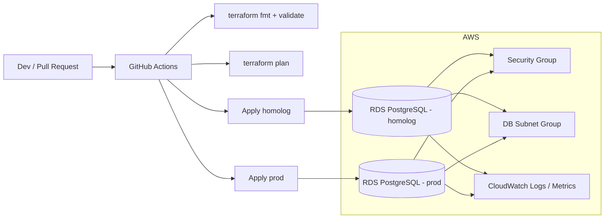
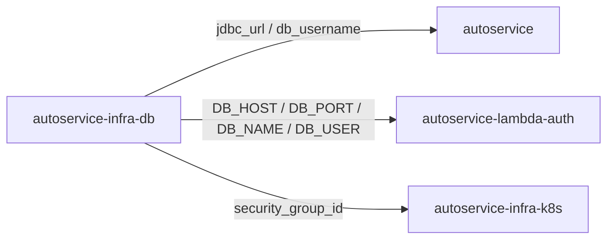
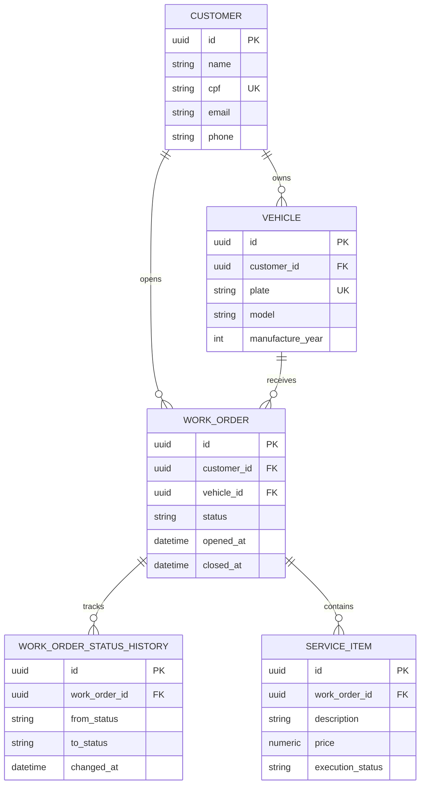

# autoservice-infra-db

Infraestrutura como codigo do banco de dados gerenciado do Tech Challenge POS TECH. Este repositorio provisiona a base PostgreSQL em AWS, com foco em seguranca, rastreabilidade, operacao corporativa e integracao com pipelines de CI/CD.

## Escopo do repositorio

- Provisionamento do banco de dados gerenciado com Terraform
- Segregacao por ambientes de homologacao e producao
- Pipeline de validacao e deploy automatizado com GitHub Actions
- Padrao de observabilidade para logs, metricas e alarmes do banco
- Documentacao tecnica das decisoes arquiteturais e da modelagem relacional

## Tecnologias

| Item | Escolha |
| --- | --- |
| Cloud | AWS |
| Banco gerenciado | Amazon RDS for PostgreSQL |
| Provisionamento | Terraform |
| CI/CD | GitHub Actions |
| Observabilidade | CloudWatch + integracao prevista com Datadog/New Relic |

## Arquitetura deste repositorio



## Contrato com os outros repositórios



## Modelo relacional e justificativa

O banco escolhido para esse ecossistema é o Amazon RDS for PostgreSQL, por oferecer consistencia transacional, suporte a constraints, indexes, JSONB e operacao com baixo custo operacional. O diagrama abaixo representa o modelo relacional principal do domínio da oficina:



## Infraestrutura provisionada

Este repositório provisiona:

- Instancia RDS PostgreSQL por ambiente (`homolog` e `prod`)
- Security Group com regra de entrada para a porta 5432
- DB Subnet Group em subnets privadas
- Secret no AWS Secrets Manager com credenciais e endpoints do banco
- Parametros do banco por `db_parameter_group` com SSL e logs de performance

## Alinhamento ao desafio corporativo

Este repositório atende ao desafio com a camada de persistência corporativa da oficina:

- Banco gerenciado PostgreSQL em AWS RDS com alta disponibilidade e backups automatizados.
- Segmentação por ambientes de homologação e produção, com deploy automático por pipeline.
- Observabilidade integrada com CloudWatch e preparação para Datadog/New Relic.
- Modelagem relacional documentada para clientes, veículos, ordens de serviço, itens, histórico de status e estoque.
- Proteção de branch com PR obrigatório e deploy automatizado após validação de Terraform.

## Scripts de inicializacao

O script SQL em `scripts/init-db.sql` cria as tabelas e indices basicos do modelo relacional, permitindo bootstrap inicial do banco em ambientes novos.

## Estrutura

```text
.
|-- .github/workflows/terraform.yml
|-- docs/
|   |-- adr/
|   |-- model/
|   `-- rfc/
|-- scripts/
|   `-- init-db.sql
`-- terraform/
    |-- environments/
    |   |-- homolog/
    |   `-- prod/
    `-- modules/managed_postgres/
```

## Pre-requisitos

- Terraform 1.6+
- Conta AWS com permissao para criar RDS, Security Group e Subnet Group
- Secrets configurados no GitHub Actions
- VPC e subnets privadas previamente provisionadas

## Como usar localmente

1. Copie o arquivo do ambiente desejado:
   ```bash
   copy terraform\environments\homolog\terraform.tfvars.example terraform\environments\homolog\terraform.tfvars
   ```
2. Ajuste os valores de rede, credenciais e tamanho da instancia. Prefira preencher `allowed_security_group_ids` com os security groups do EKS e da Lambda; use `allowed_cidrs` apenas quando precisar liberar uma faixa de rede.
3. Exporte a senha do banco como variavel de ambiente:
   ```bash
   set TF_VAR_db_password=troque-esta-senha
   ```
4. Execute o fluxo Terraform:
   ```bash
   cd terraform\environments\homolog
   terraform init -backend-config=..\..\backend.hcl
   terraform fmt -recursive ..\..
   terraform validate
   terraform plan -var-file=terraform.tfvars
   terraform apply -var-file=terraform.tfvars
   ```

## Outputs consumidos pelos outros repositórios

Depois do `apply`, este repositório expõe:

- `jdbc_url`: valor usado em `SPRING_DATASOURCE_URL` no `autoservice`;
- `db_username`: valor usado em `SPRING_DATASOURCE_USERNAME` e `DB_USER`;
- `lambda_environment`: mapa com `DB_HOST`, `DB_PORT`, `DB_NAME` e `DB_USER` para a `autoservice-lambda-auth`;
- `autoservice_environment`: mapa com variáveis base para a aplicação principal;
- `security_group_id`: security group do RDS a ser referenciado pelo cluster e pela Lambda.

Exemplo para consultar os outputs:

```bash
terraform output jdbc_url
terraform output -json lambda_environment
terraform output security_group_id
```

## CI/CD

O workflow `.github/workflows/terraform.yml` executa:

- `pull_request`: `terraform fmt -check`, `terraform init -backend=false` e `terraform validate` em `homolog` e `prod`
- `push` em `homolog`: deploy automatico em homologacao
- `push` em `prod`: deploy automatico em producao

### Secrets esperados

| Secret | Uso |
| --- | --- |
| `AWS_ROLE_TO_ASSUME` | Role com permissao para o deploy via OIDC |
| `AWS_REGION` | Regiao AWS usada no deploy |
| `TERRAFORM_STATE_BUCKET` | Bucket S3 do estado remoto |
| `TERRAFORM_LOCK_TABLE` | Tabela DynamoDB de lock do Terraform |
| `TF_VARS_HOMOLOG` | Conteudo completo do `terraform.tfvars` de homologacao |
| `TF_VARS_PROD` | Conteudo completo do `terraform.tfvars` de producao |
| `TF_VAR_db_password_homolog` | Senha do banco de homologacao |
| `TF_VAR_db_password_prod` | Senha do banco de producao |

## Links de deploy por ambiente

- Homolog (RDS endpoint): `<rds-homolog-endpoint>`
- Produção (RDS endpoint): `<rds-prod-endpoint>`

## Checklist final por ambiente

### Homolog
- [ ] Pipeline Terraform completa na branch `homolog`
- [ ] `terraform apply` com sucesso
- [ ] Outputs `jdbc_url` e `lambda_environment` publicados
- [ ] Security group liberado apenas para EKS/Lambda autorizados

### Produção
- [ ] Pipeline Terraform completa na branch `prod`
- [ ] `terraform apply` com sucesso
- [ ] Outputs `jdbc_url` e `lambda_environment` publicados
- [ ] Security group liberado apenas para EKS/Lambda autorizados

## Protecao de branch

Configurar no GitHub:

- `main` ou `master` protegida, sem push direto
- merge apenas via Pull Request
- aprovacao obrigatoria antes do merge
- status checks obrigatorios do workflow Terraform

## Documentacao adicional

- [Integracao RDS com EKS e Lambda](docs/rds-security-groups.md)
- [RFC 0001 - Plataforma de banco e rede](docs/rfc/0001-database-platform-and-networking.md)
- [ADR 0001 - Uso de AWS RDS PostgreSQL](docs/adr/0001-use-aws-rds-postgresql.md)
- [Justificativa e modelo relacional](docs/model/database-rationale.md)
- [Status de aderencia ao Tech Challenge](docs/STATUS-ADERENCIA-TECH-CHALLENGE.md)

## Swagger/Postman

Este repositorio nao expoe APIs. A documentacao de contrato das APIs protegidas deve apontar para o repositorio da aplicacao principal.

## Dockerfile

Nao se aplica. Este repositorio entrega apenas **Terraform + documentacao tecnica**.
