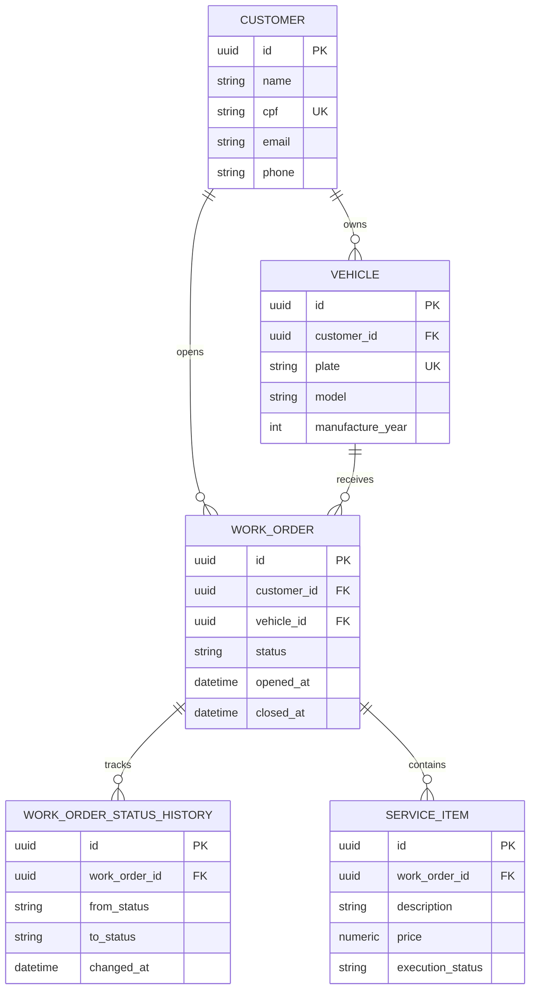

# Justificativa do banco e modelo relacional

## Escolha do banco

PostgreSQL foi escolhido por combinar consistencia transacional, modelagem relacional madura e bom suporte a indices, constraints, JSONB e consultas analiticas. Isso atende bem o dominio da oficina, que precisa garantir integridade entre clientes, veiculos, ordens de servico, itens executados e historico de status.

## Ajustes recomendados no modelo relacional

1. CPF com restricao de unicidade em `customer`.
2. Placa com restricao de unicidade em `vehicle`.
3. Historico de status separado de `work_order` para auditoria operacional.
4. Itens de servico normalizados em tabela propria para granularidade de custo e execucao.
5. Chaves estrangeiras explicitas entre cliente, veiculo e ordem de servico.

## Modelo conceitual sugerido

## Relacionamentos

- `customer` representa o cliente autenticado por CPF.
- `vehicle` vincula os automoveis do cliente e evita duplicidade de cadastro por placa.
- `work_order` centraliza o fluxo operacional da oficina.
- `work_order_status_history` suporta auditoria, metricas de tempo medio por status e analise de gargalos.
- `service_item` detalha os servicos executados e apoia dashboards de volume e falhas por item.
